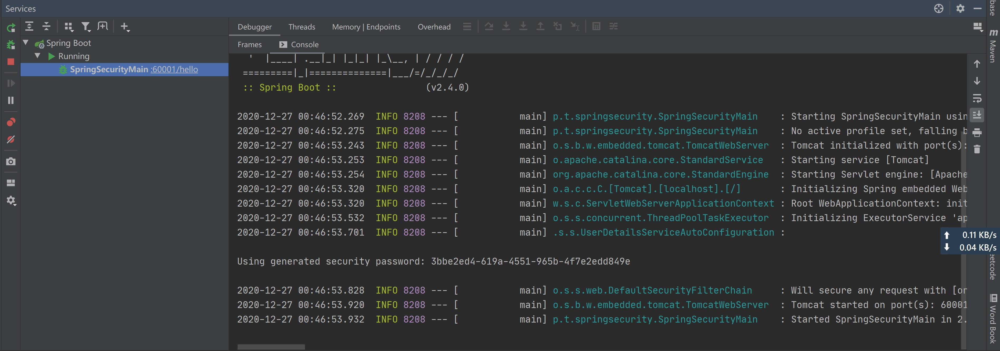
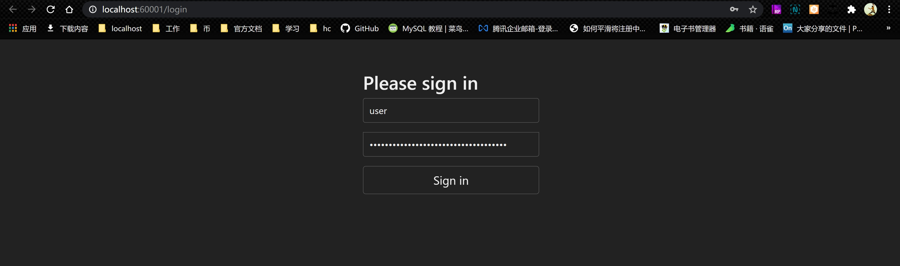
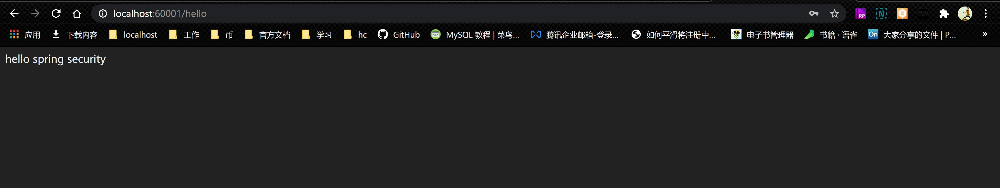

# tag: Feat：新增spring-security-helloword
## 1:访问受保护资源使用默认账密：
GET: http://localhost:60001/hello
禁用配置文件：
```properties
# security.user.name=zs
# security.user.password=zs
```
访问受保护的资源：输入默认的用户名和控制台的默认密码：user/xxxx

<hr>


<hr>


## 2:访问受保护资源使用自定义账密：
启用配置文件：输入用户名密码： zs/zs 可以访问受保护的资源
```properties
spring.security.user.name=zs
spring.security.user.password=zs
```


# 
